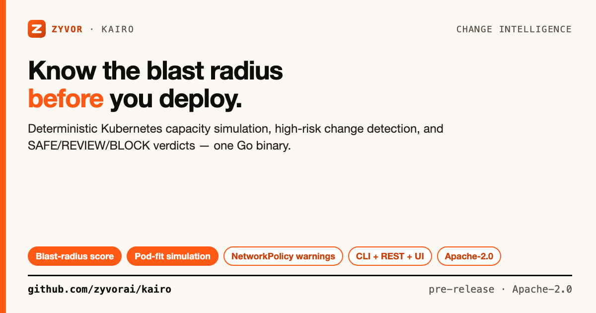

# Kairo

[](https://github.com/zyvorai/kairo/actions/workflows/ci.yml)
[](LICENSE)
[](go.mod)



**Know the blast radius before you deploy.**

📖 **[Architecture notes](docs/ARCHITECTURE.md)** — parser, simulation engine, and security model.

Kairo is an Apache-2.0 Kubernetes change-intelligence engine from Zyvor. It compares a cluster snapshot with proposed manifests, runs deterministic capacity simulation, identifies high-risk object changes, and produces a machine-readable deployment verdict.

One dependency-light Go binary serves the CLI, REST API, and embedded web dashboard.

## Contents

- [What works in this release](#what-works-in-this-release)
- [Run it](#run-it)
- [Remote deploy](#remote-deploy)
- [CLI](#cli)
- [REST API](#rest-api)
- [Get a real cluster snapshot](#get-a-real-cluster-snapshot)
- [Docker](#docker)
- [Development](#development)
- [Architecture direction](#architecture-direction)
- [License](#license)

## What works in this release

- Multi-document Kubernetes YAML and JSON ingestion.
- Node allocatable CPU, memory and `nvidia.com/gpu` capacity modelling.
- Existing bound Pod request accounting.
- Deployment, StatefulSet, DaemonSet, Pod, Job and KubeVirt `VirtualMachine` request modelling.
- Greedy pod-fit simulation with unschedulable-replica reporting.
- Workload restart/create estimates for changed manifests.
- PVC shrink detection.
- NetworkPolicy, CiliumNetworkPolicy and CiliumClusterwideNetworkPolicy change warnings.
- Strict PodDisruptionBudget detection.
- ResourceQuota pressure checks.
- Blast-radius score, LOW/MEDIUM/HIGH level and SAFE/REVIEW/BLOCK verdict.
- CLI, JSON REST API and polished zero-build web UI.
- Docker image, health endpoint, GitHub Actions CI and unit/integration tests.
- Remote systemd deploy + smoke (`scripts/deploy-remote.sh`).

> Kairo is a pre-production decision aid, not a replacement for Kubernetes admission, the real scheduler, policy engines or progressive delivery. The in-repo YAML reader supports the common Kubernetes manifest subset and JSON; advanced YAML anchors/tags are intentionally not supported in this dependency-free release.

## Run it

Requires Go 1.23+.

```bash
go run ./cmd/kairo serve
```

Open `http://localhost:8080`. The dashboard automatically loads and simulates the included production-risk demo.

Build a binary:

```bash
make build
./bin/kairo serve
```

## Remote deploy

Cross-compiles locally and installs Kairo as a systemd service over SSH (same pattern as Chimera/Scout):

```bash
# Explicit port (CLI flag)
./scripts/deploy-remote.sh 212.8.248.187 sus --port 19615

# Or via env
KAIRO_PORT=19615 ./scripts/deploy-remote.sh 212.8.248.187 sus

# Omit port → reuse .deploy-last PORT, else pick random 18000–28999
./scripts/deploy-remote.sh 212.8.248.187 sus

# Smoke (URL, --port, env, or .deploy-last)
KAIRO_URL=http://212.8.248.187:19615 ./scripts/smoke-remote.sh
./scripts/smoke-remote.sh --port 19615

# Remove
./scripts/deploy-remote.sh 212.8.248.187 sus --uninstall
```

## CLI

```bash
./bin/kairo plan \
  -cluster examples/cluster.yaml \
  -f examples/desired.yaml
```

Exit codes:

- `0`: SAFE or REVIEW
- `3`: BLOCK
- `1`: parsing/runtime error
- `2`: invalid CLI usage

Machine-readable output:

```bash
./bin/kairo plan -cluster examples/cluster.yaml -f examples/desired.yaml -json
```

## REST API

```bash
curl -s http://localhost:8080/healthz
```

```bash
curl -s http://localhost:8080/api/v1/simulate \
  -H 'content-type: application/json' \
  -d @request.json
```

Request shape:

```json
{
  "clusterYaml": "apiVersion: v1\nkind: Node\n...",
  "desiredYaml": "apiVersion: apps/v1\nkind: Deployment\n..."
}
```

## Get a real cluster snapshot

For an initial snapshot, capture resources relevant to scheduling and change impact. Adapt the list to your environment and CRDs:

```bash
kubectl get nodes,pods,deployments,statefulsets,daemonsets,services,pvc,pdb,resourcequota,networkpolicy -A -o yaml > snapshot.json
```

`kubectl get ... -o yaml` returns a `List`; the current dependency-light reader focuses on individual objects or JSON arrays. A production collector should normalize Lists into objects before the simulation engine.

## Docker

```bash
docker build -t kairo:dev .
docker run --rm -p 8080:8080 kairo:dev
```

## Development

```bash
make check
make test-e2e
```

Repository layout:

```text
cmd/kairo/             CLI + server entry point
internal/api/          REST API
internal/sim/          parser + deterministic simulation engine
internal/web/static/   embedded product dashboard
examples/              demo cluster + proposed manifests
docs/                  architecture and security notes
scripts/               integration smoke test
.github/workflows/     CI
```

## Architecture direction

The core is deliberately small enough to open-source and extend. Production-grade follow-on adapters can add:

- Kubernetes discovery/collector and informer snapshots.
- Native kube-scheduler framework integration.
- Admission webhook dry-run replay.
- Cilium/PacketWolf observed-flow replay.
- CSI/storage topology and snapshot checks.
- GPU/NVLink/MIG topology modelling.
- KubeVirt migration/topology checks.
- GitHub/GitLab PR checks and Argo CD/Flux gates.
- Historical twins, drift and multi-cluster simulations.

See [docs/ARCHITECTURE.md](docs/ARCHITECTURE.md).

## License

### Open source (Apache-2.0)

This repository is licensed under the [Apache License, Version 2.0](LICENSE).
You may use, modify, and run it for personal, lab, and commercial production
use at no charge, subject to Apache-2.0 (preserve notices / NOTICE where required).
See [NOTICE](NOTICE).

### Enterprise

Production support, SLAs, and Zyvor Enterprise products are licensed separately.
Contact [sales@zyvor.dev](mailto:sales@zyvor.dev) or see [zyvor.dev](https://zyvor.dev).
