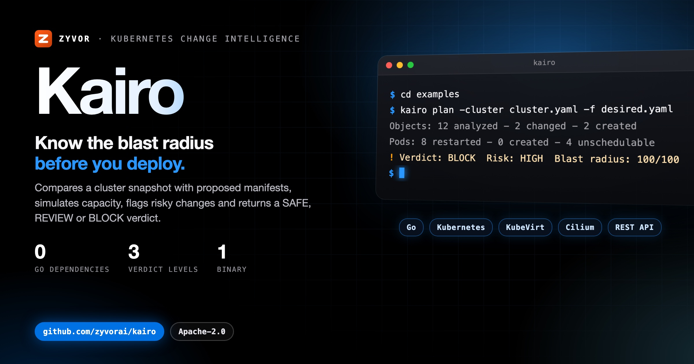
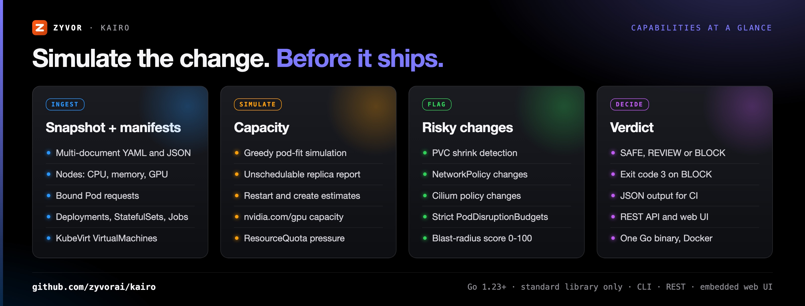
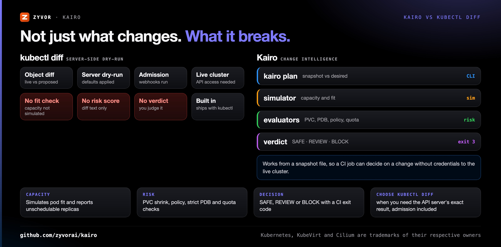
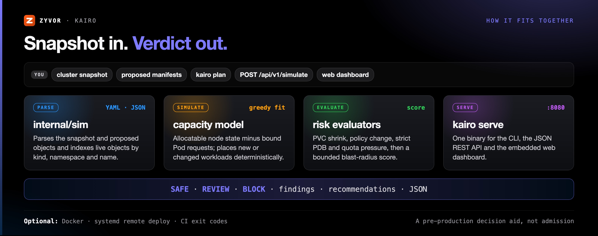

<div align="center">

# Kairo

[](https://github.com/zyvorai/kairo/actions/workflows/ci.yml)
[](LICENSE)
[](go.mod)

[](https://zyvor.dev/schedule?utm_source=github&utm_medium=kairo&utm_campaign=readme_hero)
[](https://zyvor.dev/poc?utm_source=github&utm_medium=kairo&utm_campaign=readme_hero)
[](#quickstart)



### Know the blast radius before you deploy.

**Kubernetes change intelligence.** Kairo compares a cluster snapshot with proposed manifests, runs deterministic capacity simulation, identifies high-risk object changes, and produces a machine-readable SAFE, REVIEW or BLOCK verdict. One dependency-light Go binary serves the CLI, REST API, and embedded web dashboard.

**SAFE · REVIEW · BLOCK** · **Deterministic capacity simulation** · **0 Go dependencies** · **1 binary: CLI, API, web** · **Apache-2.0**

📖 **[Architecture notes](docs/ARCHITECTURE.md)** — parser, simulation engine, and security model.

</div>

---

## Why Kairo

| When this happens… | Kairo gives you… |
|---|---|
| A rollout leaves replicas Pending because the cluster was already full | Greedy pod-fit simulation against allocatable CPU, memory and `nvidia.com/gpu`, with unschedulable replicas reported before deploy |
| A one-line change restarts more workloads than anyone expected | Restart and create estimates for every changed manifest |
| Someone shrinks a PVC or tightens a NetworkPolicy in a big diff | PVC shrink detection and NetworkPolicy, CiliumNetworkPolicy and CiliumClusterwideNetworkPolicy change warnings |
| A strict PodDisruptionBudget blocks the drain mid-change | Strict PDB detection and ResourceQuota pressure checks |
| Reviewers read YAML diffs and guess the risk | A blast-radius score, a LOW/MEDIUM/HIGH level and a SAFE/REVIEW/BLOCK verdict |
| CI has no way to stop a risky change | `kairo plan` exits `3` on BLOCK, with `-json` output for pipelines |



<a id="what-works-in-this-release"></a>

### What works in this release

- Multi-document Kubernetes YAML and JSON ingestion.
- Node allocatable CPU, memory and `nvidia.com/gpu` capacity modelling.
- Existing bound Pod request accounting.
- Deployment, StatefulSet, DaemonSet, Pod, Job and KubeVirt `VirtualMachine` request modelling.
- Greedy pod-fit simulation with unschedulable-replica reporting.
- Workload restart/create estimates for changed manifests.
- PVC shrink detection.
- NetworkPolicy, CiliumNetworkPolicy and CiliumClusterwideNetworkPolicy change warnings.
- Strict PodDisruptionBudget detection.
- ResourceQuota pressure checks.
- Blast-radius score, LOW/MEDIUM/HIGH level and SAFE/REVIEW/BLOCK verdict.
- CLI, JSON REST API and polished zero-build web UI.
- Docker image, health endpoint, GitHub Actions CI and unit/integration tests.
- Remote systemd deploy + smoke (`scripts/deploy-remote.sh`).

---

## Kairo vs kubectl diff



| | **Kairo** | **`kubectl diff`** (server-side dry-run) |
|---|---|---|
| Question it answers | Will this change fit, and how risky is it? | What exactly will change in the live objects? |
| Input | A cluster snapshot file plus proposed manifests | Proposed manifests against the live API server |
| Capacity | Simulates pod fit and reports unschedulable replicas | Not checked |
| Risk checks | PVC shrink, policy changes, strict PDBs, quota pressure | Shows the diff; judging it is up to you |
| Output | Blast-radius score, LOW/MEDIUM/HIGH, SAFE/REVIEW/BLOCK, JSON, CI exit code | A unified diff of each object |
| Admission and defaulting | Not modelled (Kairo is not admission) | Applied by the API server during dry-run |
| **Choose kubectl diff when** | | You need the API server's exact result, admission webhooks and defaults included, and a diff is all you need |

They work well together: `kubectl diff` for the exact object changes, Kairo for capacity and risk.

---

## How it fits together



```text
              Git / Helm / GitOps / CI
                       |
                       v
+--------------------------------------------------+
|                 Kairo simulation                 |
|                                                  |
|  parse -> index live objects -> model capacity   |
|       -> evaluate desired objects -> score       |
|                                                  |
|  scheduling  PVC  PDB  quota  policy  KubeVirt  |
+---------------------+----------------------------+
                      |
            +---------+---------+
            |         |         |
           CLI       REST      Web
```

Simulation lifecycle, and why the engine does not pretend to be kube-scheduler: [docs/ARCHITECTURE.md](docs/ARCHITECTURE.md).

---

<a id="run-it"></a>

## Quickstart

Requires Go 1.23+.

```bash
go run ./cmd/kairo serve
```

Open `http://localhost:8080`. The dashboard automatically loads and simulates the included production-risk demo.

Build a binary:

```bash
make build
./bin/kairo serve
```

## CLI

```bash
./bin/kairo plan \
  -cluster examples/cluster.yaml \
  -f examples/desired.yaml
```

Exit codes:

- `0`: SAFE or REVIEW
- `3`: BLOCK
- `1`: parsing/runtime error
- `2`: invalid CLI usage

Machine-readable output:

```bash
./bin/kairo plan -cluster examples/cluster.yaml -f examples/desired.yaml -json
```

## REST API

```bash
curl -s http://localhost:8080/healthz
```

```bash
curl -s http://localhost:8080/api/v1/simulate \
  -H 'content-type: application/json' \
  -d @request.json
```

Request shape:

```json
{
  "clusterYaml": "apiVersion: v1\nkind: Node\n...",
  "desiredYaml": "apiVersion: apps/v1\nkind: Deployment\n..."
}
```

## Get a real cluster snapshot

For an initial snapshot, capture resources relevant to scheduling and change impact. Adapt the list to your environment and CRDs:

```bash
kubectl get nodes,pods,deployments,statefulsets,daemonsets,services,pvc,pdb,resourcequota,networkpolicy -A -o yaml > snapshot.json
```

`kubectl get ... -o yaml` returns a `List`; the current dependency-light reader focuses on individual objects or JSON arrays. A production collector should normalize Lists into objects before the simulation engine.

## Docker

```bash
docker build -t kairo:dev .
docker run --rm -p 8080:8080 kairo:dev
```

## Remote deploy

Cross-compiles locally and installs Kairo as a systemd service over SSH (same pattern as Chimera/Scout):

```bash
# Explicit port (CLI flag)
./scripts/deploy-remote.sh 212.8.248.187 sus --port 19615

# Or via env
KAIRO_PORT=19615 ./scripts/deploy-remote.sh 212.8.248.187 sus

# Omit port → reuse .deploy-last PORT, else pick random 18000–28999
./scripts/deploy-remote.sh 212.8.248.187 sus

# Smoke (URL, --port, env, or .deploy-last)
KAIRO_URL=http://212.8.248.187:19615 ./scripts/smoke-remote.sh
./scripts/smoke-remote.sh --port 19615

# Remove
./scripts/deploy-remote.sh 212.8.248.187 sus --uninstall
```

## Development

```bash
make check
make test-e2e
```

Repository layout:

```text
cmd/kairo/             CLI + server entry point
internal/api/          REST API
internal/sim/          parser + deterministic simulation engine
internal/web/static/   embedded product dashboard
examples/              demo cluster + proposed manifests
docs/                  architecture and security notes
scripts/               integration smoke test
.github/workflows/     CI
```

## Architecture direction

The core is deliberately small enough to open-source and extend. Production-grade follow-on adapters can add:

- Kubernetes discovery/collector and informer snapshots.
- Native kube-scheduler framework integration.
- Admission webhook dry-run replay.
- Cilium/PacketWolf observed-flow replay.
- CSI/storage topology and snapshot checks.
- GPU/NVLink/MIG topology modelling.
- KubeVirt migration/topology checks.
- GitHub/GitLab PR checks and Argo CD/Flux gates.
- Historical twins, drift and multi-cluster simulations.

See [docs/ARCHITECTURE.md](docs/ARCHITECTURE.md).

---

## Maturity

> Kairo is a pre-production decision aid, not a replacement for Kubernetes admission, the real scheduler, policy engines or progressive delivery. The in-repo YAML reader supports the common Kubernetes manifest subset and JSON; advanced YAML anchors/tags are intentionally not supported in this dependency-free release.

The engine does not yet execute scheduler framework plugins, topology spread, affinity/anti-affinity, taints/tolerations, CSI topology, device plugins, webhooks or controller reconciliation; those are extension points ([docs/ARCHITECTURE.md](docs/ARCHITECTURE.md)).

---

## Part of the Zyvor stack

| Product | Role next to Kairo |
|---|---|
| **Kairo** | Kubernetes change intelligence: capacity simulation, risk checks, deployment verdict |
| **[Zorvia](https://github.com/zyvorai/zyvor-zorvia)** | Pairs with Kairo: Kairo models KubeVirt `VirtualMachine` requests, so VM changes get the same preflight |
| **[Janus](https://github.com/zyvorai/janus)** | Pairs with Kairo: a full GPU scheduling simulator (MIG, topology, gang jobs) where Kairo models `nvidia.com/gpu` capacity only |
| **[Haven](https://github.com/zyvorai/zyvor-haven)** | Pairs with Kairo on the same private-cloud clusters: Keycloak + HA Postgres as one identity plane |

→ [zyvor.dev](https://zyvor.dev)

---

## License

Kairo is **free and open source** under the [Apache License, Version 2.0](LICENSE). You may use, modify, and run it for personal, lab, and commercial production use at no charge, subject to Apache-2.0 (preserve notices / NOTICE where required). See [NOTICE](NOTICE). That does not change.

**Zyvor Enterprise** adds what production teams ask for: supported releases, deployment and upgrade guidance, priority incident triage, a named technical contact and 24x7 critical intake. Production support, SLAs, and Zyvor Enterprise products are licensed separately. Plans and terms: [docs/SUBSCRIPTION-MODEL.md](docs/SUBSCRIPTION-MODEL.md) · [Pricing](https://zyvor.dev/pricing?utm_source=github&utm_medium=kairo&utm_campaign=readme_license) · [sales@zyvor.dev](mailto:sales@zyvor.dev).

Contributions: [CONTRIBUTING.md](CONTRIBUTING.md). Report vulnerabilities privately per [SECURITY.md](SECURITY.md).

---

<div align="center">

### Put a verdict on every change before it ships

[](https://zyvor.dev/schedule?utm_source=github&utm_medium=kairo&utm_campaign=readme_footer)
[](https://zyvor.dev/poc?utm_source=github&utm_medium=kairo&utm_campaign=readme_footer)
[](https://zyvor.dev/pricing?utm_source=github&utm_medium=kairo&utm_campaign=readme_footer)
[](mailto:sales@zyvor.dev?subject=Kairo)
[](https://github.com/zyvorai/kairo)

</div>
